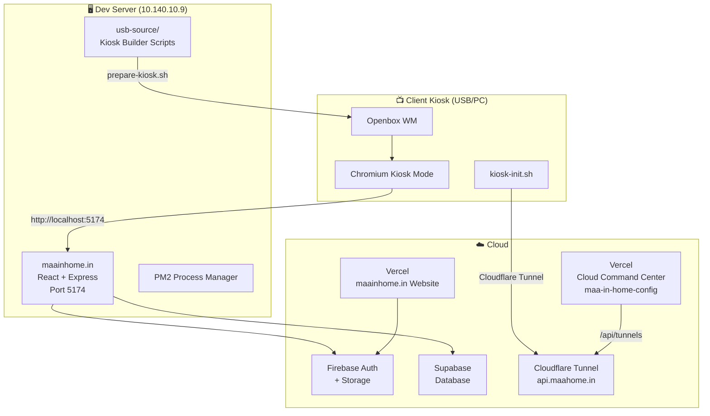
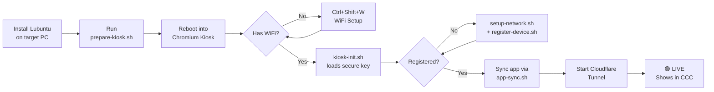

# MaainHome — Full Business Flow

## Business Concept
Ship a **pre-configured USB drive** to customers. Plug it into any PC → boots directly into the **MaainHome Station** kiosk app. No Windows, no setup — a plug-and-play appliance for local commerce.

---

## System Architecture

---

## Components

| Component | Location | Tech | Purpose |
|---|---|---|---|
| **maainhome.in** | Dev Server (port 5174) + Vercel | React, Express, Vite, Firebase, Supabase | Main web app: Seller/Buyer dashboards, KYC, inventory, map search |
| **maainhome-ccc** | [Vercel](https://vercel.com/senthils-projects-03ee8410/maa-in-home-config) | HTML/JS/CSS | Cloud Command Center — admin dashboard for kiosk fleet management |
| **maa-in-home-config** | [GitHub](https://github.com/coolsen201/maa-in-home-config) | Same as CCC + Vercel API | Source repo for CCC, includes `/api/tunnels.js` serverless function |
| **usb-source/** | Dev Server: `~/websites/maainhome.in/usb-source/` | Bash scripts, systemd | Kiosk provisioning: installer USBs, kiosk setup scripts |
| **Android APK** | Firebase Storage | React Native / Capacitor | Mobile app for sellers and buyers |

---

## User Roles & Flows

### 1. 👤 Buyer Flow
1. Visit `maainhome.in` or install Android APK
2. Browse products by proximity (PostGIS-based location search)
3. View seller shop pages and negotiate prices
4. Interact via Jitsi video call (from kiosk stations)

### 2. 🏪 Seller Flow
1. Register → Email Verification → KYC (5 photos + form)
2. Wait for Admin Approval
3. Once approved → access Seller Dashboard
4. Add products (camera scan, barcode, 3-level categories)
5. Manage inventory (inline edit, stock, pricing)
6. Product limit: 100 until March 2026

### 3. 🛡️ Admin Flow
1. Access Admin Dashboard on the main app
2. Approve/Reject/Block sellers via KYC review
3. Monitor kiosks via **Cloud Command Center** (CCC)
4. Register new kiosk stations, revoke keys
5. View station status: Online/Pending/Maintenance

---

## Kiosk Lifecycle

### Key Files
| Script | Purpose |
|---|---|
| `prepare-kiosk.sh` | Convert fresh Lubuntu → kiosk (installs Openbox, Chromium, locks down GUI) |
| `kiosk-init.sh` | Boot service: loads identity, syncs app, starts tunnel |
| `setup-network.sh` | WiFi selector (QR scan → manual fallback) |
| `register-device.sh` | Registers kiosk with CCC, gets secure key |
| `app-sync.sh` | Pulls latest app version to kiosk |

---

## Infrastructure

| Service | Domain/Address | Purpose |
|---|---|---|
| Dev/Prod Server | `10.140.10.9` | PM2-managed Node processes |
| Website | `maainhome.in` (Vercel) | Public-facing web app |
| CCC Dashboard | Vercel (maa-in-home-config) | Fleet management UI |
| API Tunnel | `api.maahome.in` (Cloudflare) | Secure kiosk ↔ server communication |
| Auth | Firebase Authentication | Email/password, Google sign-in |
| Database | Firebase Firestore | Products, shops, users, KYC (collections) |
| APK Hosting | Firebase Storage | Android app distribution |
| Video Calls | Jitsi (`meet.jit.si`) | In-kiosk customer meetings |

---

## Current Version
- **Web App**: v2.0.0
- **Android APK**: v1.0.13 (93MB, Firebase Storage)
- **Stable Tags**: `v1.3.1` (cross-platform auth + mobile UX)
